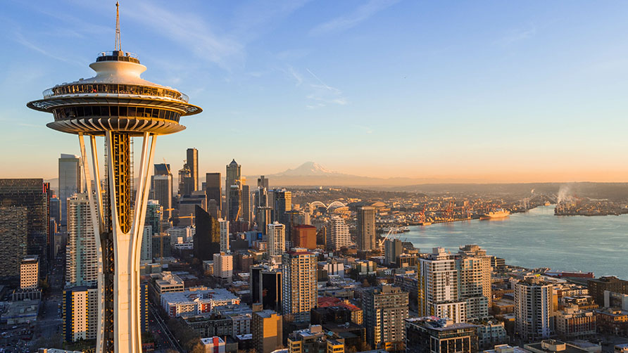

# Join us for the OSA Community roadshow on Real Time Data Lakes and AI in Seattle. 

​Join us in Seattle to learn how to build high-performance real-time data lake systems. Talks will be followed by networking, with food and drinks provided.

[Register Here](https://luma.com/aq6hvwzv)

##  