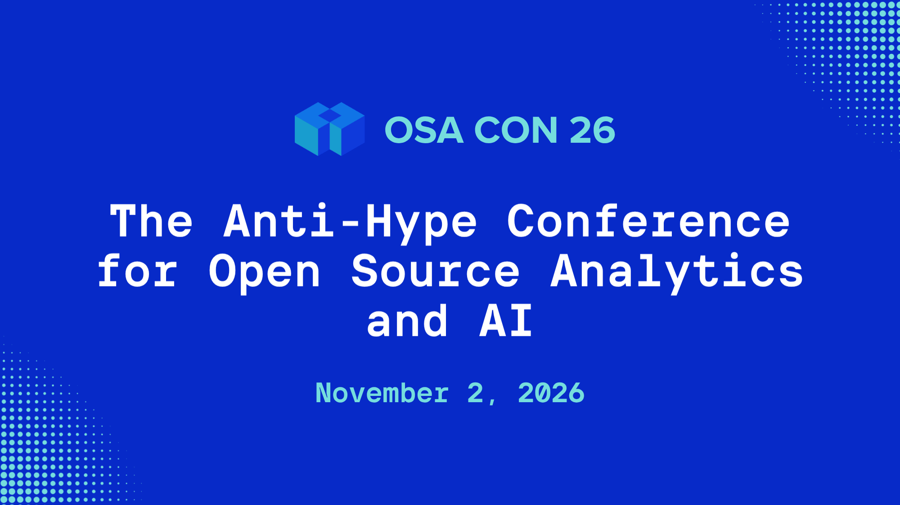

  

  

    <h1 style="font-size:3rem;">OSA Con 2026 Goes Hybrid:  Join Us in San Francisco or Online</h1><a href="https://osacon.io/" title="visit osacon.io" target="_blank">
    

      
    
</a>
  

## The OSA Community is proud to announce OSA Con 2026! 

For the first time ever, [Open Source Analytics Conference (OSA Con)](https://osacon.io/) is stepping beyond the screen. After five years as a virtual conference, we’re bringing the community together in person on November 2nd at AWS Builder Loft in San Francisco, while still keeping things accessible with a full livestream. 

This year, engineers, architects, and builders get real about the convergence of open source tech and AI models. We’ll look at how AI workloads are putting pressure on data infrastructure, where agents are showing up in analytics stacks, and how automated decision-making is evolving with better data loops. Alongside that, expect discussions on real-time systems, shared architectures, and new open source tools pushing the space forward.

We will be announcing speakers and sessions over the next few months. Stay tuned! 

## Pre-registration is open! 

You can pre-register (online or in-person) [here](https://luma.com/eis7567t?utm_source=osacommunityblogannouncement).
To stay in the loop, join the community [Slack](https://go.osacom.io/slack), [subscribe for updates](https://subscribepage.io/7rOdqZ), or visit [osacon.io](http://osacon.io). 

 

