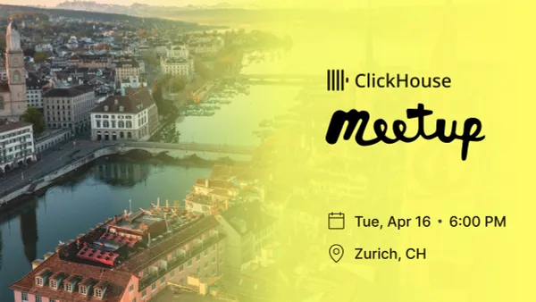

{ .img-fluid }

Hey there, data enthusiasts and ClickHouse aficionados! We've got some exciting news to share - our next meetup is on the horizon, and it's going to be in Zurich! Get ready for a delightful mix of mind-boggling data tales, insightful conversations, and maybe even a surprise or two up our sleeves.

But here's the deal: to secure your spot, make sure you register ASAP!

Agenda:
6:00 - 6:40 - Arrival and Check-in
6:40 - 7:00 - Talk #1 Analytics at Beekeeper - Why Clickhouse & Data Durability" by Andrei Isac and Adhi Sutandi
7:20 - 7:40 - Talk #2
7:40 - 8:00 - Talk #3 ClickHouse Updates and Roadmap + Q&A by a ClickHouse engineer (TBD).
8:00 - 8:30 - Food, Drinks, and Conversation

If you are interested in speaking at a future event, please contact tyler@clickhouse.com

Location:
Beekeeper AG
Hardturmstrasse 181
8005 Zürich