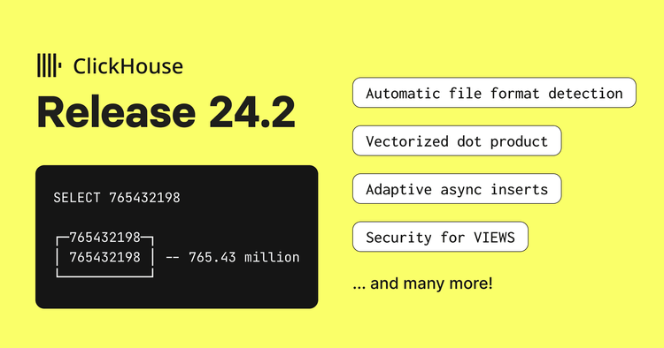

{ .img-fluid }

Can you believe it’s already March?! Time is flying, but the good thing about another month going by is that we have another ClickHouse release for you to enjoy!

ClickHouse version 24.2 contains 18 new features 🎁 18 performance optimisations 🛷 49 bug fixes 🐛

### New Contributors
As always, we send a special welcome to all the new contributors in 24.2! ClickHouse's popularity is, in large part, due to the efforts of the community that contributes. Seeing that community grow is always humbling.

Below are the names of the new contributors:
> johnnymatthews, AlexeyGrezz, Aris Tritas, Charlie, Fille, HowePa, Joshua Hildred, Juan Madurga, Kirill Nikiforov, Nickolaj Jepsen, Nikolai Fedorovskikh, Pablo Musa, Ronald Bradford, YenchangChan, conicliu, jktng, mikhnenko, rogeryk, una, Кирилл Гарбар_



