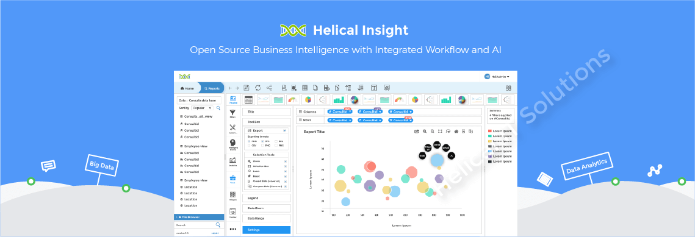

{ .img-fluid }

Helical IT Solutions has launched Helical Insight version 5.2.1, a major update in the realm of open-source Business Intelligence (BI). This release aims to provide a cost-effective and scalable alternative to traditional BI tools like PowerBI, Tableau, and Quicksight, with a focus on democratizing data analytics.

The [project Github repo can be found here](https://github.com/helicalinsight/helicalinsight).

The platform's open-source nature make it accessible to businesses of all sizes, offering flexible deployment options. Its browser-based interface allows self-service analytics, supporting internal teams and external clients alike.

Key enterprise-grade features include embedding, white-labeling, and Single Sign-On (SSO) integration, making it ideal for companies wanting to integrate customizable dashboards and analytics. Enhanced security and drill-down capabilities further elevate its utility for advanced analytics.

A major enhancement in version 5.2.1 is the expanded support for various data sources, including direct API integration. This update simplifies working with multiple file formats—Excel, CSV, JSON, and more—hosted on cloud platforms like Azure, AWS, and GCP. Users can now analyze data without third-party software, significantly broadening the platform's application.

New chart types and advanced data visualization options have been introduced. The update also enhances dashboard-level customization, with features like tabbed views, overlays, and custom dropdowns, improving interactivity and visual appeal.

The platform aims to bridge the gap in BI adoption by offering a robust open-source alternative to expensive proprietary solutions, empowering businesses to drive data-driven decisions.

Looking ahead, Helical Insight is integrating Generative AI (GenAI) for chat-based analytics, because, you know, AI.