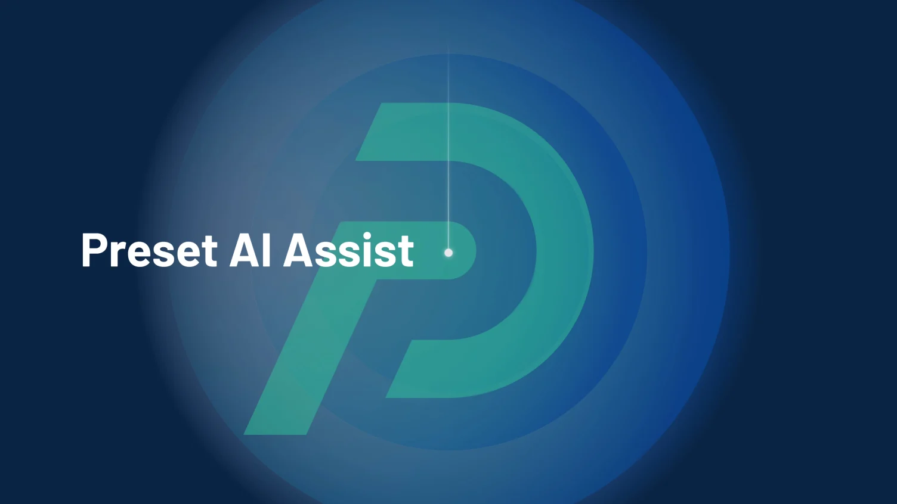

{ .img-fluid }

> We’re excited to announce the launch of **AI Assist**, a powerful new Preset feature that empowers users of all levels to write SQL queries with ease. Whether you're a seasoned data analyst or just starting out, AI Assist helps you translate your questions and prompts from plain English into SQL queries in seconds.

AI Assist makes it possible to quickly retrieve answers about your data while still providing transparency on the SQL query generated. For newer SQL writers, AI Assist can bridge the gap between understanding your data needs and translating them into queries. This removes the initial technical hurdle of getting to a SQL query, further democratizing data access for teams. For experienced SQL users, AI Assist helps save time by leveraging AI to understand your data structures, quickly identifying the right tables, columns, and joins needed for your analysis.

### How to Use AI Assist
In SQL Lab, simply type your question or prompt into the AI Assist toolbar and AI Assist will generate the corresponding SQL query. After generating your query, you have the option to run the query immediately or review the SQL query first before running it. Once your query has been generated, AI Assist will also provide suggestions or warnings (when applicable) to enhance your SQL queries.

For more details about how AI Assist works, check out our documentation, and stay tuned to our blog for an upcoming post detailing the technology behind this feature.

### Availability
Currently, the following databases are supported:
 * BigQuery
 * PostgreSQL
 * Snowflake

### Getting started with AI Assist
Ready to unlock the power of AI in your data analysis? To activate this feature, your team admin needs to enable AI Assist for your workspace.

AI Assist is available for Preset customers on the Professional and Enterprise Plans. This feature is not currently available on the Starter Plan or for Professional trials. Don’t have a Preset account yet? You can sign up for a free account today and contact our Sales team to upgrade and gain access to AI Assist.