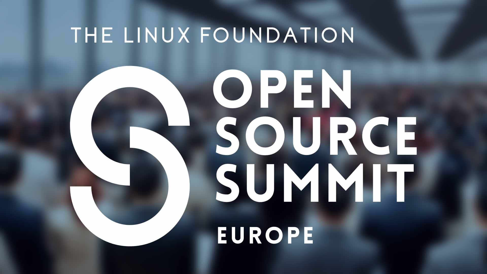

Open Source Summit Europe 2025 brought together thousands of developers, maintainers, and technology leaders to celebrate and advance the open source ecosystem. Among the conference's many sessions and discussions, two announcements stood out as particularly significant for the future of open source collaboration.

{ .img-fluid }

&nbsp; 

## DocumentDB Joins the Linux Foundation Family
[DocumentDB joins the Linux Foundation](https://www.linuxfoundation.org/press/linux-foundation-welcomes-documentdb-to-advance-open-developer-first-nosql-innovation), continuing a trend that began last year with [OpenSearch](https://www.linuxfoundation.org/press/linux-foundation-announces-opensearch-software-foundation-to-foster-open-collaboration-in-search-and-analytics) and [Valkey](https://www.linuxfoundation.org/press/linux-foundation-launches-open-source-valkey-community).

#### What is DocumentDB?
From the project’s [GitHub page](https://github.com/documentdb/documentdb): _DocumentDB is a MongoDB compatible open source document database… It offers a native implementation of a document-oriented NoSQL database, enabling seamless CRUD (Create, Read, Update, Delete) operations on BSON(Binary JSON) data types._

The project was originally created at Microsoft and it now sees strong support from many other vendors including Amazon Web Services and Google. As a Linux Foundation Project, we can expect continued support from a wide variety of vendors and contributors.

#### How is this different?
Unlike OpenSearch and Valkey, which began as forks of ElasticSearch and Redis respectively, DocumentDB is a completely separate but compatible implementation of MongoDB APIs. It should come as no surprise that this new implementation is built on-top of the PostgreSQL engine.

#### What it means
This pattern reveals something profound about the evolution of open source infrastructure. First —  it’s Postgres all the way down. And second — Data stores represent the foundation upon which modern applications are built. When these critical components remain open source, they enable:
* **Open Innovation:** Developers can modify and extend databases to meet their specific needs
* **Data portability:** Organizations maintain control over their data layer without vendor lock-in
* **Community-driven development:** Features and improvements come from real-world use cases across diverse industries

The Linux Foundation's embrace of these data store projects sends a clear message: the infrastructure that powers our digital world should remain open and accessible to all. When projects play games with licenses, the community is prepared to respond.

## The Developer Relations Foundation: Building Bridges in Open Source
Last year the Linux Foundation [announced](https://www.linuxfoundation.org/press/linux-foundation-announces-intent-to-form-developer-relations-foundation) its intent to form the [Developer Relations Foundation](https://dev-rel.org/), a dedicated initiative to support the developer relations profession. This move recognizes the critical role that developer advocates, evangelists, and community managers play in the success of open source projects.

Now that intention has been realized and the Developer Relations Foundation has officially formed. The foundation leverages the successful CNCF community-driven model in order to advance maturity and excellence in developer relations.

That’s no small task! The field has been fraught with challenges and — as a developer advocate I can say — we seem to suffer from a perennial identity crisis. We’re constantly torn between our community roots and our employer’s need to demonstrate and measure value.

To answer these challenges, the Developer Relations Foundations has several working-groups who have been working on some excellent resources for DevRel professionals. These resources include a tools catalog, a persona library, and a framework for metrics.

Personally, I am excited for the possibility of new tools and frameworks to automate the less exciting parts of DevRel so that I can spend more time doing the best part — interfacing directly with the community.

## Why This All Matters
These announcements at Open Source Summit Europe reflect a maturing ecosystem that understands both the technical and human elements necessary for sustainable open source development. 

As I reflect on Open Source Summit Europe 2025, it's clear that the future of technology remains firmly rooted in collaboration, openness, and community.

The talks will be posted on YouTube over the coming week.
***

*What are your thoughts on these developments? [Join the conversation on Slack.](https://join.slack.com/t/osacommunityworkspace/shared_invite/zt-2j5oq8pa9-3z2STvxxRsrzhYkPOMwX4A)*
