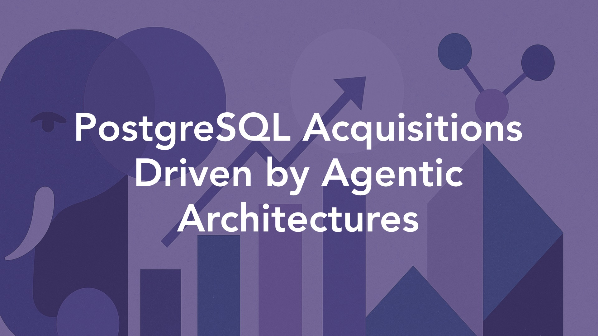

  

  

    <h1 style="font-size:2.5rem;">Postgres Acquisitions Driven by Agentic Architectures</h1>
    
By Joshua Lee | July 9, 2025

    

     
    

  

The recent PostgreSQL acquisitions - Snowflake's $250M purchase of Crunchy Data and Databricks' $1B acquisition of Neon - feel seismic. These deals signal two things:

<ul>
<li>PostgreSQL's emergence as the operational backbone for AI-native applications</li>
<li>The importance of open-source technology in the data layer for these same applications.</li>
</ul>

## The AI agent revolution drives database strategy

> **“80% of databases on Neon's platform are created by AI agents rather than humans.”** 

This is the most striking fact sprinkled in this news, and it marks a fundamental shift in database provisioning as the core driver behind these acquisitions. Avinash captured the sentiment on <a href="https://www.linkedin.com/posts/avinash-s-553378151_postgresql-neon-crunchydata-activity-7335996644993171457-4ZMJ/" target="_blank" >LinkedIn</a>. "It's more than just adding another database, calling it a strategic bet on PostgreSQL as the backbone of the AI-native era, especially in its serverless and cloud-native form. Imagine AI agents spinning up databases for every real-time task or experiment, then discarding them. Traditional databases can't handle this 'disposable' scale."

This "agentic AI" infrastructure represents a new paradigm where databases must support machine-speed provisioning and disposal. Databricks CEO Ali Ghodsi reinforced this vision, noting that **70% of their customers have legacy databases they want to replace** with systems "fit for the AI era." The acquisitions position both companies to capture what Snowflake's leadership calls a "$350 billion market opportunity" in modernizing database infrastructure for AI workloads.

These acquisitions enable a unified architecture where AI applications can seamlessly blend operational and analytical data - a capability that has eluded data platforms for decades. As Gartner's Robin Schumacher observed, "Data warehouse and analytic vendors who have tried to enter the operational/transactional DBMS market have mostly failed. Teradata and Vertica are examples." (via [The Register](https://www.theregister.com/2025/06/10/snowflake_and_databricks_bank_postgresql/)) 

The key difference now? PostgreSQL's trusted position among developers, with the database [surpassing MySQL](https://dbconvert.com/blog/mysql-vs-postgres-in-2024/) in developer surveys for the first time in 2024.

## Valuation divergence reveals competing platform philosophies

The 4x valuation difference between the deals - $1B for three-year-old Neon versus $250M for twelve-year-old Crunchy Data - reveals two different Go-To-Market strategies. Neon commanded approximately **33x revenue multiple** while Crunchy Data traded at a more traditional **8x revenue multiple**.

It should come as no surprise that AI-hype is a driving factor in the difference: The premium for Neon reflects its serverless architecture optimized for AI workloads, while Crunchy Data's immediate value lies in **FedRAMP compliance** and deep enterprise relationships with government agencies and Fortune 500 financial institutions.

The financial community sees both valuations as justified given current market dynamics. David Menninger from ISG Software Research noted, "The cost of the acquisition shows how hot agentic AI development is right now. Databricks' valuation makes it easier to buy than build." 

With Databricks having raised $19B in financing, the company has positioned itself for aggressive acquisition strategies, spending **$4.3B in 18 months** across MosaicML, Tabular, and now Neon.

## The Impact to the Open Source Postgres Community

The PostgreSQL community's reaction reveals a nuanced perspective balancing enthusiasm for mainstream adoption with concerns about commercial influence on the open-source project. 

From what we've read, community forums and technical discussions show **cautious optimism** - viewing the acquisitions as validation of PostgreSQL's technical excellence while maintaining vigilance about preserving open-source principles.

Both of the acquired companies have strong track records of open source contributions. Crunchy Data's Kubernetes operator innovations and Neon's serverless architecture advances are worthy of respect. 

We hope that this will continue under the new owners — and for their part, both Snowflake and Databricks have emphasized their continued commitment to PostgreSQL development in acquisition announcements, though the community remains watchful about whether engineering contributions will continue at previous levels.

The community's measured response reflects historical experience with database acquisitions. As one Hacker News commenter noted, the PostgreSQL Global Development Group's strong governance model should protect against the "embrace, extend, extinguish" pattern seen in previous open-source acquisitions.

We see these deals accelerating the database's evolution. With PostgreSQL already supporting vector operations for AI workloads through pgvector and offering superior JSON handling for modern applications, the acquisitions provide resources to further strengthen these capabilities. 

The community consensus: while risks exist, the potential benefits of expanded adoption and investment outweigh concerns if companies honor their open-source commitments.

## Conclusion

These PostgreSQL acquisitions mark an inflection point in data lakehouse architecture, driven by the unprecedented demands of AI agents. The deals validate PostgreSQL's emergence as critical infrastructure for AI-native applications while highlighting divergent strategies for capturing this opportunity. 

The true significance lies not in the acquisitions themselves but in what they enable - a future where AI agents seamlessly orchestrate data infrastructure at scales impossible for human operators.

